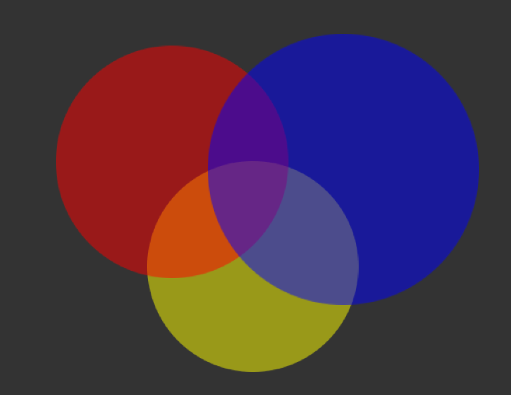
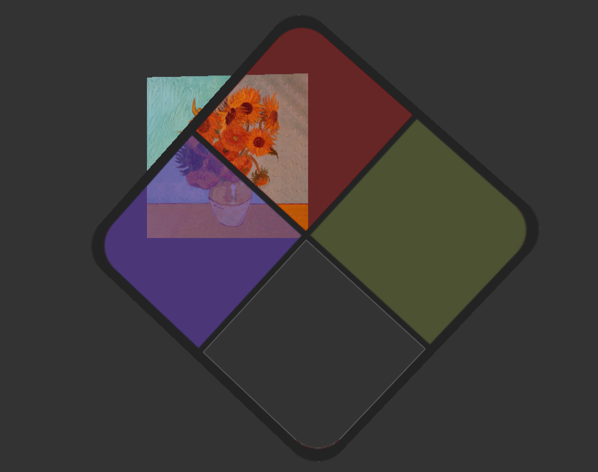
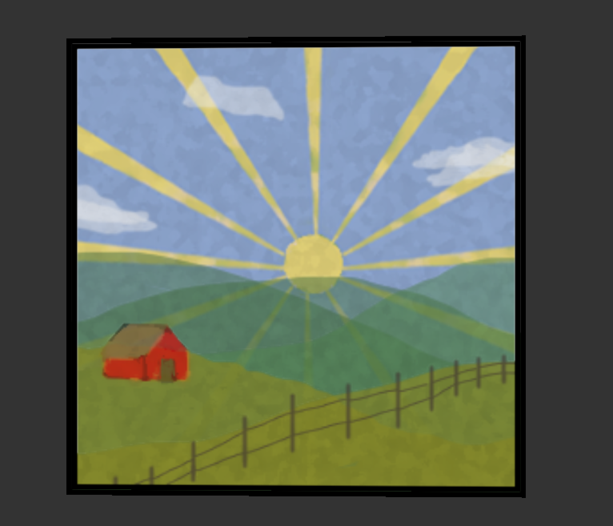
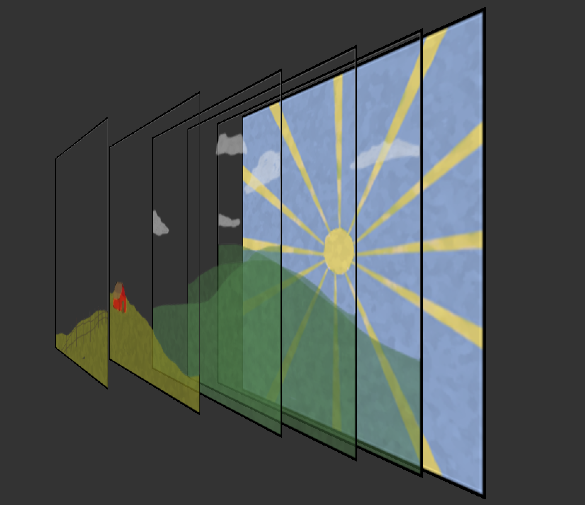

## YouTube Link: https://youtu.be/U9ri2-7obqg

## How to Run Program:
* Download main KateCaputo_Graphics_Blending
* Navigate to 'code' folder
* In the command line, run `python3 build.py`
* In the command line, run `./project`

## Project Features:
* Left and right mouse movement pans the camera
* Arrow keys move the camera forward, backward, left, and right
* Shift buttons move camera up (R shift) and down (L shift)
* Pressing the '2' key renders the second scene
  * Within scene #2 pressing the 'r' key starts and stops the window pane rotation
* Pressing the '3' key renders the third scene
* Pressing the '2' key renders the original scene
* All scene changes ('1', '2', '3') reset the camera to the origin

* Inspiration : https://mdzahidh.github.io/cs148/assets/best/visuals/01-report.pdf
* Main Resource : https://learnopengl.com/Advanced-OpenGL/Blending
* External Code : 'stb_image.h' file

