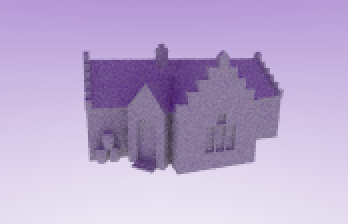
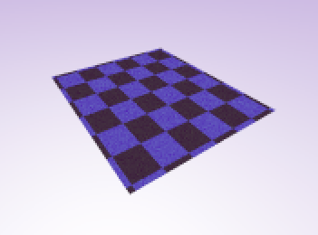
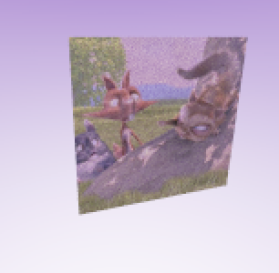
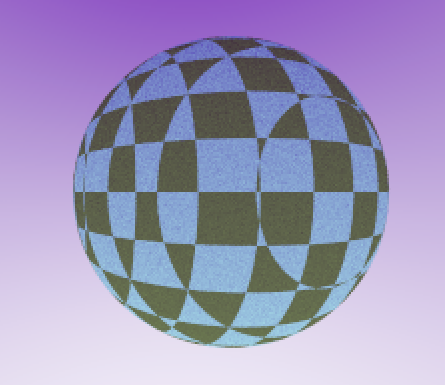

## YouTube Link: https://youtu.be/-zy2VHru-8o

* Name and partners name(At most teams of 2 folks total)
  * Team member 1: Kate Caputo
* How many hours did it take you to complete this final project? 16
* Did you collaborate or share ideas with any other students/TAs/Professors? OH
* Did you use any external resources? 
  * Note it is fair to utilize some tutorials--cite them here. You **must** add your own personal touch however!
  * Shirly text #2
  * https://www.scratchapixel.com/lessons/3d-basic-rendering/ray-tracing-rendering-a-triangle/moller-trumbore-ray-triangle-intersection
  * https://gamedev.stackexchange.com/questions/23743/whats-the-most-efficient-way-to-find-barycentric-coordinates
  * (Optional) What was the most interesting part of the Final Assignment? How could the instructor improve the final project?
    the most interesting part of this assignment was finding all the different approaches to the issue of projecting texture coordinates. I went through several different iterations, involving barycentric coordinates, matricies and rotation, dot and cross products, all before landing on this final iteration of the computations. Each method worked partway and likely could have been tweaked to work on its own but my code definitely went though several different phases.

### Rubric

<table>
  <tbody>
    <tr>
      <th>Points</th>
      <th align="center">Description</th>
    </tr>
    <tr>
      <td>(33.3%) Project Completion</td>
     <td align="left"><ul><li>Does the project compile and run.</li><li>Is it polished without any bugs (No weird visual artifacts).</li><li>Did you make a video?</li><li>Did you add a screenshot of your project to the repository?</li></ul></td>
    </tr>
    <tr>
      <td>(33.3%) Technical</td>
      <td align="left"><ul><li>Was the implementation of the project challenging?</li><li>Even if you followed a tutoral, it should not be trivial, and have some personal touch to it.</li><li>Did you have to organize/process a sufficient amount of data?</li><li>Was it clear you consulted some outside resources that go above and beyond the scope of this class</li></ul></td>
    </tr>
    <tr>
      <td>(33.4%) Creativity</td>
      <td align="left"><ul><li>How visually appealing is the scene?<ul><li>Note: There should be some 'wow' factor--instructors discretion is used here.</li></ul></li><li>How original is the project<ul><li>Again, did you enhance a tutorial and do something unique or just go by the book?</li></ul></li></ul></td>
    </tr>
  </tbody>
</table>
